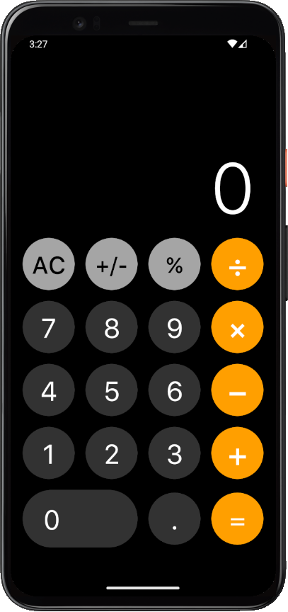
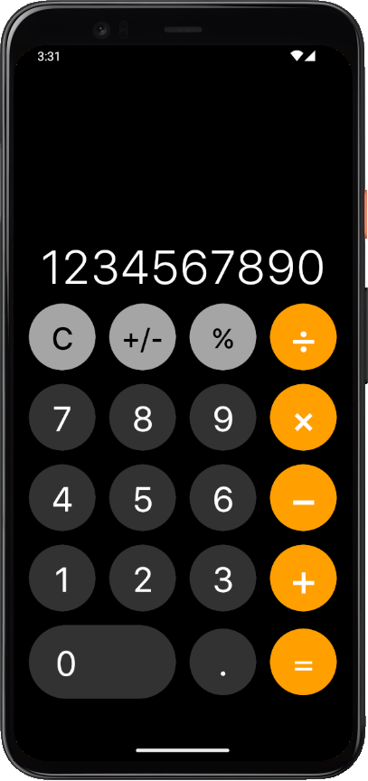

# uCalculator
uCalculator is a simple clone of iOS calculator app, built with
[Jetpack Compose](https://developer.android.com/jetpack/compose). The goal of building this app is to learn UI tricks by trying to copy layout of the existing app.

To try out this sample app, use the latest stable version
of [Android Studio](https://developer.android.com/studio).
You can clone this repository or import the project.

## Screenshots

<div style="display: flex;background-color: white">
    
    
</div>

## Features

* `User-Friendly Interface:` uCalculator boasts an easy-to-navigate user interface, mimicking the clean and minimalistic design of the iOS calculator. Users can perform calculations effortlessly and efficiently.
* `Basic Arithmetic Operations:` The app allows users to perform fundamental arithmetic operations such as addition, subtraction, multiplication, and division. This functionality is akin to the core features of the iOS calculator.

## License

```
Copyright (c) 2023 Mykhailo Isaiev

Permission is hereby granted, free of charge, to any person obtaining a copy
of this software and associated documentation files (the "Software"), to deal
in the Software without restriction, including without limitation the rights
to use, copy, modify, merge, publish, distribute, sublicense, and/or sell
copies of the Software, and to permit persons to whom the Software is
furnished to do so, subject to the following conditions:

The above copyright notice and this permission notice shall be included in all
copies or substantial portions of the Software.

THE SOFTWARE IS PROVIDED "AS IS", WITHOUT WARRANTY OF ANY KIND, EXPRESS OR
IMPLIED, INCLUDING BUT NOT LIMITED TO THE WARRANTIES OF MERCHANTABILITY,
FITNESS FOR A PARTICULAR PURPOSE AND NONINFRINGEMENT. IN NO EVENT SHALL THE
AUTHORS OR COPYRIGHT HOLDERS BE LIABLE FOR ANY CLAIM, DAMAGES OR OTHER
LIABILITY, WHETHER IN AN ACTION OF CONTRACT, TORT OR OTHERWISE, ARISING FROM,
OUT OF OR IN CONNECTION WITH THE SOFTWARE OR THE USE OR OTHER DEALINGS IN THE
SOFTWARE.
```